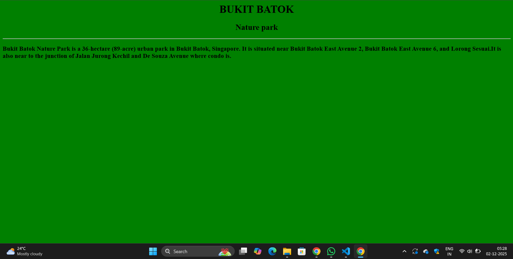
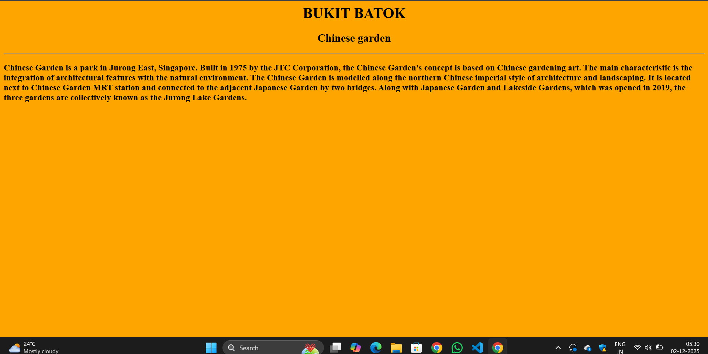
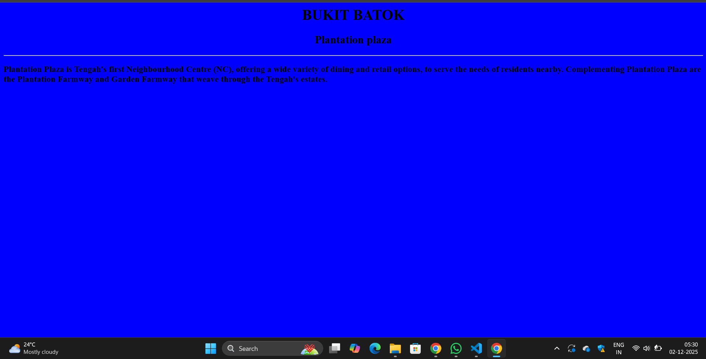
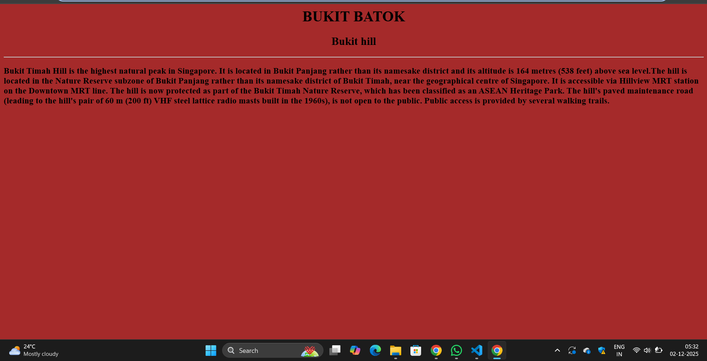
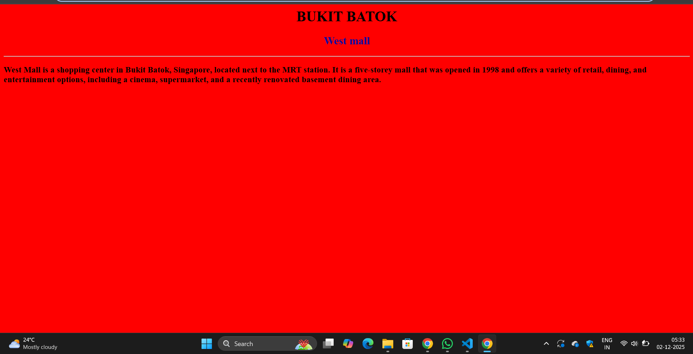

# Ex03 Places Around Me
## Date: 2-12-2025

## AIM
To develop a website to display details about the places around my house.

## DESIGN STEPS

### STEP 1
Create a Django admin interface.

### STEP 2
Download your city map from Google as an image.

### STEP 3
Insert the image using `````` tag and link it to the map.

### STEP 4
Using ```<map>``` tag name the map.

### STEP 5
Create clickable regions in the image using ```<area>``` tag.

### STEP 6
Write HTML programs for all the regions identified.

### STEP 7
Execute the programs and publish them.

## CODE
```
ABCD.html
<html>
    <head>
        <title>MAPPING</title>
    </head>
    <body>
        <h1 align="center">SINGAPORE(Bukit batok)</h1>
        <h2 align="center">Gautam-(25009613)</h3>
        

<map name="image-map">
    <area target="" alt="west mall" title="west mall" href="westmall.html" coords="898,345,1103,469" shape="rect">
    <area target="" alt="plantation plaza" title="plaza" href="plaza.html" coords="403,133,71" shape="circle">
    <area target="" alt="bukit hill" title="bukit hill" href="hill.html" coords="1207,191,1276,148,1355,177,1366,257,1287,299,1210,265" shape="poly">
    <area target="" alt="Chinese garden" title="Chinese garden" href="garden.html" coords="167,881,333,884,262,788" shape="poly">
    <area target="" alt="Nature park" title="Nature park" href="park.html" coords="1585,485,83" shape="circle">
</map>

    </body>
</html> 

park.html
<html>
    <head>
        <title>BUKIT BATOK</title>
    </head>
    <body bgcolor="green">
        <h1 align="center">BUKIT BATOK</h1>
        <h2 align="center">Nature park</h2>
        <hr>
        <h3>Bukit Batok Nature Park is a 36-hectare (89-acre) urban park in Bukit Batok, Singapore. It is situated near Bukit Batok East Avenue 2, Bukit Batok East Avenue 6, and Lorong Sesuai.It is also near to the junction of Jalan Jurong Kechil and De Souza Avenue where condo is.</h3>
    </body>
</html>

garden.html
<html>
    <head>
        <title></title>
    </head>
    <body bgcolor="orange">
        <h1 align="center">BUKIT BATOK</h1>
        <h2 align="center">Chinese garden</h2>
        <hr>
        <h3>Chinese Garden is a park in Jurong East, Singapore. Built in 1975 by the JTC Corporation, the Chinese Garden's concept is based on Chinese gardening art.  The main characteristic is the integration of architectural features with the natural environment. The Chinese Garden is modelled along the northern Chinese imperial style of architecture and landscaping. It is located next to Chinese Garden MRT station and connected to the adjacent Japanese Garden by two bridges. Along with Japanese Garden and Lakeside Gardens, which was opened in 2019, the three gardens are collectively known as the Jurong Lake Gardens.</h3>

    </body>
</html>

plaza.html
<html>
    <head>
        <title></title>
    </head>
    <body bgcolor="blue">
        <h1 align="center">BUKIT BATOK</h1>
        <h2 align="center">Plantation plaza</h2>
        <hr>
        <h3>Plantation Plaza is Tengah's first Neighbourhood Centre (NC), offering a wide variety of dining and retail options, to serve the needs of residents nearby. Complementing Plantation Plaza are the Plantation Farmway and Garden Farmway that weave through the Tengah's estates.</h3>

    </body>
</html>

hill.html
<html>
    <head>
        <title></title>
    </head>
    <body bgcolor="brown">
        <h1 align="center">BUKIT BATOK</h1>
        <h2 align="center">Bukit hill</h2>
        <hr>
        <h3>Bukit Timah Hill is the highest natural peak in Singapore. It is located in Bukit Panjang rather than its namesake district and its altitude is 164 metres (538 feet) above sea level.The hill is located in the Nature Reserve subzone of Bukit Panjang rather than its namesake district of Bukit Timah, near the geographical centre of Singapore. It is accessible via Hillview MRT station on the Downtown MRT line. The hill is now protected as part of the Bukit Timah Nature Reserve, which has been classified as an ASEAN Heritage Park. The hill's paved maintenance road (leading to the hill's pair of 60 m (200 ft) VHF steel lattice radio masts built in the 1960s), is not open to the public. Public access is provided by several walking trails.</h3>

    </body>
</html>

westmall.html
<html>
    <head>
        <title></title>
    </head>
    <body bgcolor="red">
        <h1 align="center">BUKIT BATOK</h1>
        <h2 align="center"><font color="sandal">West mall</font></h2>
        <hr>
        <h3>West Mall is a shopping center in Bukit Batok, Singapore, located next to the MRT station. It is a five-storey mall that was opened in 1998 and offers a variety of retail, dining, and entertainment options, including a cinema, supermarket, and a recently renovated basement dining area. </h3>

    </body>
</html>

```

## OUTPUT








## RESULT
The program for implementing image maps using HTML is executed successfully.
